# Chapter 4: System Design — PCAP Analysis Module

## Code Evidence Summary

### Backend files analyzed
- `Backend/app.py`
- `Backend/activity_logs.py`
- `Backend/pcap_engine/jobs.py`
- `Backend/pcap_engine/tshark_runner.py`
- `Backend/pcap_engine/cic_stream_features.py`
- `Backend/pcap_engine/ml_infer.py`
- `Backend/pcap_engine/heuristics.py`
- `Backend/pcap_engine/scorer.py`
- `Backend/pcap_engine/reporter.py`
- `Backend/pcap_engine/zeek_runner.py`
- `Backend/pcap_engine/zeek_loader.py`
- `Backend/pcap_engine/flow_features.py`
- `Backend/pcap_engine/security_logic.py`
- `Backend/pcap_engine/cleanup.py`
- `Backend/gamification/models.py`
- `Backend/reports/monthly_security_report_service.py`
- `Backend/reports/monthly_security_report_renderer.py`

### Frontend files analyzed
- `Cybersecurity Dashboard Design/src/components/pages/PcapAnalyzerPage.tsx`
- `Cybersecurity Dashboard Design/src/components/pages/ChatbotWorkspacePage.tsx`
- `Cybersecurity Dashboard Design/src/components/admin/PcapAnalysisAdminControl.tsx`
- `Cybersecurity Dashboard Design/src/components/admin/ReportsExportCenterPage.tsx`
- `Cybersecurity Dashboard Design/src/services/adminPcapOverview.ts`
- `Cybersecurity Dashboard Design/src/services/adminReportsService.ts`
- `Cybersecurity Dashboard Design/src/utils/recentPcapAlerts.ts`
- `Cybersecurity Dashboard Design/src/utils/pcapChartSelectors.ts`
- `Cybersecurity Dashboard Design/src/utils/activityLogs.ts`
- `Cybersecurity Dashboard Design/src/utils/gamification.ts`

### Database/model files analyzed
- `Backend/app.py` SQLAlchemy models: `User`, `UserNotification`, `AdminNotificationRead`, `PcapAlertRecord`, `MonthlySecurityReport`, `AdminAuditLog`, `SecurityAuditLog`, `RefreshToken`.
- `Backend/activity_logs.py` SQLAlchemy model: `UserActivityLog`.
- `Backend/gamification/models.py` SQLAlchemy models: `GamificationEvent`, `UserGamificationProfile`, `UserBadge`, `UserChallenge`, `GamificationDailyStat`, `UserAlertReviewState`, `InvestigationNote`.
- `Backend/pcap_engine/jobs.py` disk-persisted job state: `JobState` stored as `state.json`; not a relational database table.

### Confirmed PCAP endpoints
- `POST /pcap/analyze` and `POST /analyze-pcap`: upload `.pcap` or `.pcapng`, create/reuse job, submit background pipeline.
- `POST /pcap/analyze-local` and `POST /analyze-local`: analyze server-local PCAP path after path validation.
- `GET /pcap/jobs` and `GET /jobs`: list authorized recent jobs.
- `GET /pcap/result/<job_id>`, `GET /pcap/status/<job_id>`, and `GET /job/<job_id>`: poll job status and inline `report` when done.
- `GET /pcap/report/<job_id>` and `GET /job/<job_id>/export?type=report|evidence|bundle`: export `report.json` or Zeek evidence bundle ZIP.
- `GET /api/pcap/alerts` and `GET /pcap/alerts`: list persisted user-visible PCAP alert records.
- `POST /api/chatbot/pcap`: rule/context-based PCAP chatbot response using latest or selected authorized job.

### Confirmed admin endpoints
- `POST /api/admin/auth/login`, `POST /api/admin/auth/verify-2fa`, `GET /api/admin/auth/me`: admin authentication.
- `GET /api/admin/pcap/overview`: admin PCAP overview from disk-backed job registry and report artifacts.
- `GET /api/admin/pcap/jobs/<job_id>/export?type=report|evidence`: admin export of PCAP report JSON or evidence ZIP.
- `GET /api/admin/audit-logs` and `GET /api/admin/audit-logs/export`: admin audit log and CSV export.
- `GET /api/admin/reports/pcap/...` endpoints referenced by `adminReportsService.ts` are not confirmed in backend code; the frontend falls back to local generated PDF/CSV blobs.

### Confirmed database tables/models
- `user`: authentication, profile, notification preferences, 2FA/admin fields.
- `pcap_alert`: persisted PCAP alert/summary records linked to `user.id`.
- `user_activity_logs`: PCAP activity events such as upload, analysis start/completion/failure, report download, evidence download, chatbot question.
- `user_notification`: PCAP job started/completed/failed/report/evidence/suspicious/critical notifications.
- `admin_audit_log`: admin actions including PCAP export.
- `admin_notification_read`: read-state for admin notifications.
- `monthly_security_report`: monthly report payloads that can include PCAP section data.
- `gamification_event`, `user_gamification_profile`, `user_badge`, `user_challenge`, `gamification_daily_stat`, `user_alert_review_state`, `investigation_note`: gamification and investigation records used by PCAP UI/actions.
- PCAP job records are not a SQL table; they are `JobState` JSON files under `Backend/pcap_runs/_jobs/<job_id>/state.json`, with `report.json` in the same job folder.

### Confirmed frontend pages/components
- `PcapAnalyzerPage`: upload, poll, report normalization, report/evidence export, history, charts, alert/cluster/timeline views.
- `ChatbotWorkspacePage`: PCAP mode posts to `/api/chatbot/pcap` with optional `analysis_id`.
- `PcapAnalysisAdminControl`: admin PCAP operations dashboard, overview loading, JSON summary export, report/evidence artifact export.
- `ReportsExportCenterPage`: admin reports UI for PCAP and Identity reports; PCAP report generation/export uses partially connected backend URLs and local fallback PDF/CSV generation.

### Confirmed job statuses
- `queued`
- `running`
- `done`
- `error`
- `failed` is normalized to `error` in `Backend/pcap_engine/jobs.py`; the React page maps `error` to UI status `failed`.

### Confirmed report/export features
- Report artifact: `report.json`, returned/downloaded as `application/json`.
- Evidence artifact: `evidence_bundle.zip`, available only when Zeek evidence files exist.
- Report fields from `Backend/pcap_engine/reporter.py`: `meta`, `summary`, `module_contract`, `risk_per_ip`, `clusters`, `alerts`, `timeline`.
- Alert fields include flow-level `type`, `ts`, `src_ip`, `dst_ip`, `dst_port`, `ml_label`, `ml_confidence`, `classification_confidence`, `confidence`, `threat_confidence`, `severity`, `reason`, Zeek evidence fields, DNS/HTTP/SSL summary fields, and heuristic details.
- Admin backend exports only report JSON and evidence ZIP for PCAP jobs. Admin PDF/CSV report exports in `adminReportsService.ts` are frontend fallback behavior, not confirmed backend PCAP report endpoints.

### Confirmed chatbot features
- `POST /api/chatbot/pcap` is implemented.
- Chatbot context is built from authorized user-owned jobs and `report.json`.
- Responses are rule/intent based via `_pcap_chatbot_intent()` and `_pcap_chatbot_answer()`.
- Context fields include selected/latest job, summary, threat items, attack counts, severity counts, top IPs, protocols, ports, recommendations, and total user jobs.
- Chatbot activity is recorded as `pcap_chatbot_question` in `user_activity_logs` when a user is authenticated.

### Missing or uncertain parts
- A relational `pcap_jobs` table is not confirmed from code; PCAP jobs are file-backed JSON state.
- Backend PDF export for PCAP job reports is not confirmed from code.
- Backend CSV export for PCAP job reports is not confirmed from code.
- Frontend `/api/admin/reports/pcap/generate`, `/api/admin/reports/pcap/<id>/export`, and `/api/admin/reports/pcap/<id>/regenerate` are planned / not confirmed from backend code.
- Raw packet payload storage inside reports is not confirmed from code; reports use derived flow, alert, cluster, timeline, and evidence summary fields.
- Zeek is optional and controlled by `include_zeek`; evidence ZIP is unavailable when Zeek files are absent.

## 4.1 Sequence Diagrams

### User PCAP Upload and Analysis Flow

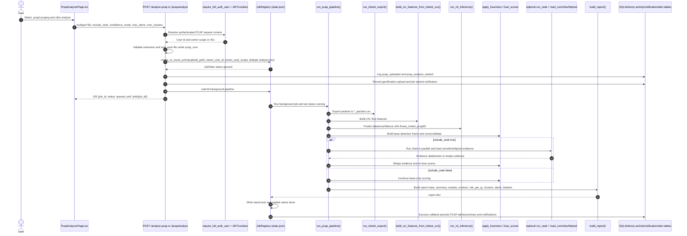

### User Viewing PCAP Report Flow

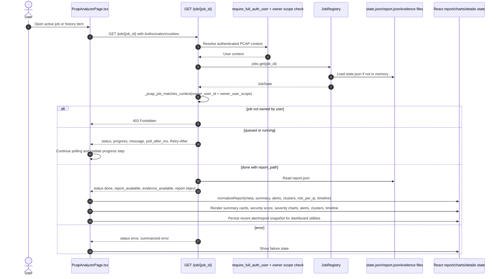

### User Report and Evidence Export Flow

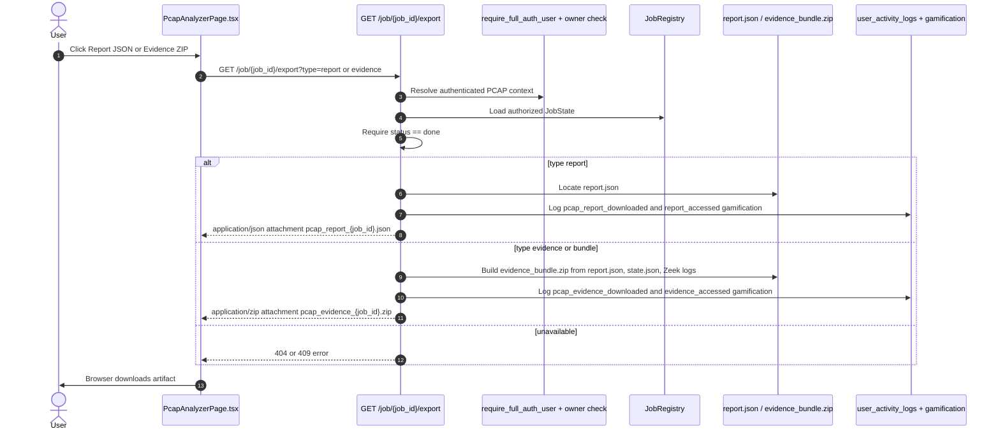

### Admin PCAP Overview and Artifact Export Flow

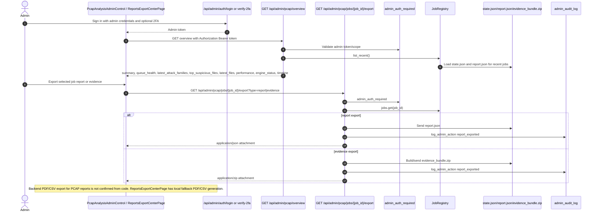

### PCAP Chatbot Flow

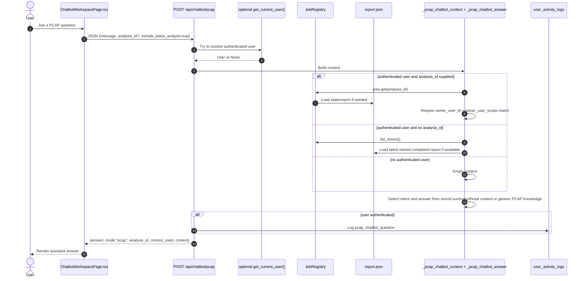

## 4.2 Entity Relationship Diagram ERD

```mermaid
erDiagram
    USER {
        int id PK
        string email UK
        string full_name
        string phone
        string job_title
        string company
        boolean is_email_verified
        boolean email_notifications_enabled
        boolean telegram_notifications_enabled
        boolean is_two_factor_enabled
        string admin_role
        string admin_status
        datetime created_at
        datetime last_login_at
    }

    PCAP_ALERT {
        int id PK
        int user_id FK
        string job_id
        string alert_key UK
        string source_type
        string type
        string title
        text message
        string severity
        string status
        string risk_label
        int threats_count
        int flows_analyzed
        string filename
        string attack_type
        string protocol
        string src_ip
        string dst_ip
        datetime event_at
        text metadata_json
        datetime created_at
    }

    USER_ACTIVITY_LOGS {
        int id PK
        string event_id UK
        int user_id FK
        string module
        string action_type
        string title
        text description
        string status
        string severity
        int risk_score
        string target_type
        string target_id
        string target_label
        string ip_address
        boolean is_sensitive
        boolean is_suspicious
        datetime created_at
        text metadata_json
    }

    USER_NOTIFICATION {
        int id PK
        int user_id FK
        string type
        string severity
        string title
        text body
        string job_id
        boolean is_read
        datetime created_at
    }

    MONTHLY_SECURITY_REPORT {
        int id PK
        int user_id FK
        string report_month
        int report_year
        text report_payload_json
        string pdf_path
        string status
        datetime created_at
    }

    ADMIN_AUDIT_LOG {
        int id PK
        int actor_user_id
        string actor_name
        string actor_email
        string actor_role
        string action_type
        string action_label
        string module
        string target_type
        string target_id
        string target_label
        string status
        string severity
        datetime created_at
    }

    ADMIN_NOTIFICATION_READ {
        int id PK
        string admin_email
        string notification_key
        datetime read_at
    }

    GAMIFICATION_EVENT {
        int id PK
        int user_id FK
        string event_type
        string event_key UK
        string job_id
        string alert_id
        int points_awarded
        datetime created_at
    }

    USER_GAMIFICATION_PROFILE {
        int user_id PK
        int total_points
        int current_level
        string current_level_name
        int current_streak
        int total_scans
        int total_reviewed_alerts
        int total_badges
        datetime updated_at
    }

    USER_ALERT_REVIEW_STATE {
        int id PK
        int user_id FK
        string job_id
        string alert_id
        string review_status
        string disposition
        datetime first_viewed_at
        datetime reviewed_at
        datetime updated_at
    }

    INVESTIGATION_NOTE {
        int id PK
        int user_id FK
        string job_id
        string alert_id
        text note_body
        datetime created_at
    }

    PCAP_JOB_STATE {
        string job_id PK
        string status
        string created_at
        string started_at
        string finished_at
        int progress
        string message
        int owner_user_id
        string owner_user_scope
        string upload_path
        string packet_csv_path
        string report_path
        string evidence_dir
        string error
    }

    USER ||--o{ PCAP_ALERT : owns
    USER ||--o{ USER_ACTIVITY_LOGS : records
    USER ||--o{ USER_NOTIFICATION : receives
    USER ||--o{ MONTHLY_SECURITY_REPORT : has
    USER ||--o{ GAMIFICATION_EVENT : earns
    USER ||--|| USER_GAMIFICATION_PROFILE : has
    USER ||--o{ USER_ALERT_REVIEW_STATE : reviews
    USER ||--o{ INVESTIGATION_NOTE : writes
    PCAP_JOB_STATE ||--o{ PCAP_ALERT : "linked by job_id file backed not FK"
    PCAP_JOB_STATE ||--o{ USER_NOTIFICATION : "linked by job_id (not FK)"
    PCAP_JOB_STATE ||--o{ GAMIFICATION_EVENT : "linked by job_id (not FK)"
    PCAP_JOB_STATE ||--o{ USER_ALERT_REVIEW_STATE : "linked by job_id (not FK)"
    PCAP_JOB_STATE ||--o{ INVESTIGATION_NOTE : "linked by job_id (not FK)"
```

Notes:
- PCAP jobs are file-backed `JobState` JSON records, not a relational table.
- `PCAP_JOB_STATE` is inferred from `Backend/pcap_engine/jobs.py` dataclass and disk JSON access code, not from an ORM model.
- `pcap_alert.job_id`, `user_notification.job_id`, gamification/review/note `job_id` fields are string links to file-backed job IDs, not declared foreign keys.

## 4.3 Data Flow Diagrams

### DFD Level 0: PCAP Analysis Module Context

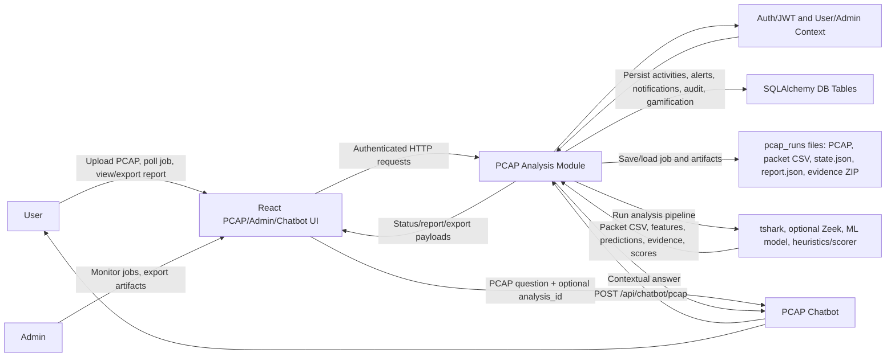

### DFD Level 1: Implemented PCAP Processing

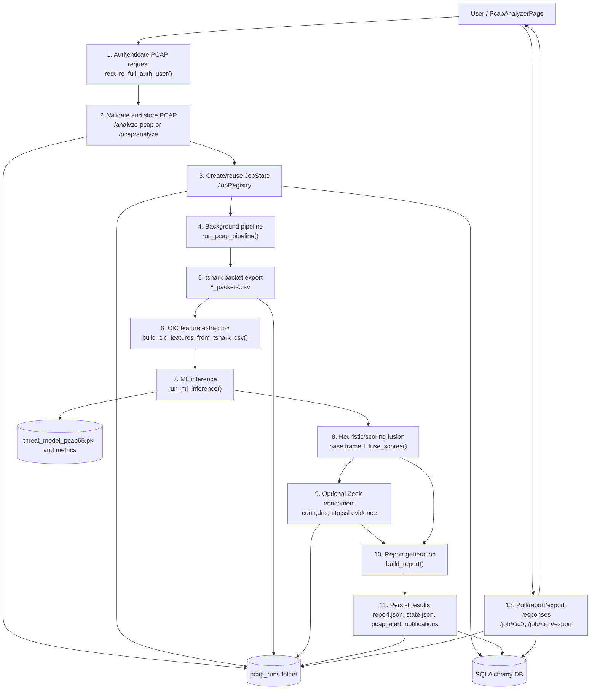

## 4.4 State Diagram

```mermaid
stateDiagram-v2
    [*] --> queued: JobRegistry.create_or_reuse_active()
    queued --> running: jobs.submit() runner starts
    running --> running: progress/message updates; export, features, ML, Zeek, scoring, report
    running --> done: pipeline returns report and report.json is written
    running --> error: exception during pipeline
    done --> [*]: report/evidence available for polling/export
    error --> [*]: summarized error returned

    note right of queued
      Persisted in state.json.
      Status values confirmed:
      queued, running, done, error.
    end note

    note right of error
      "failed" is normalized to "error"
      in JobRegistry; frontend maps error
      to failed for display.
    end note
```

## 4.5 Use Case Diagrams

### User PCAP Use Cases

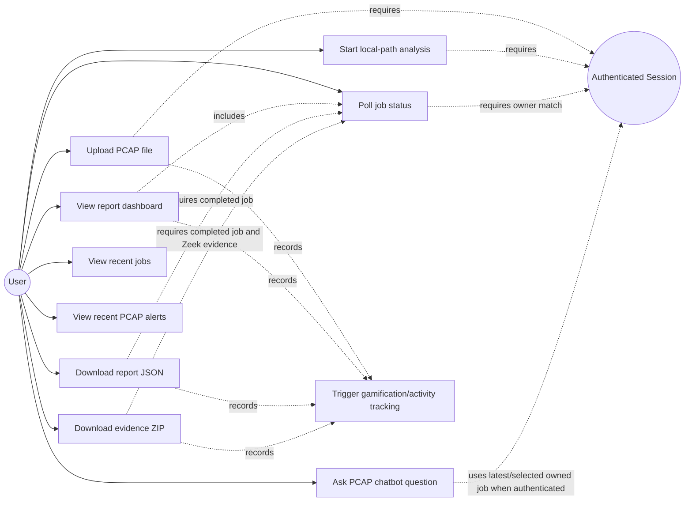

### Admin PCAP Use Cases

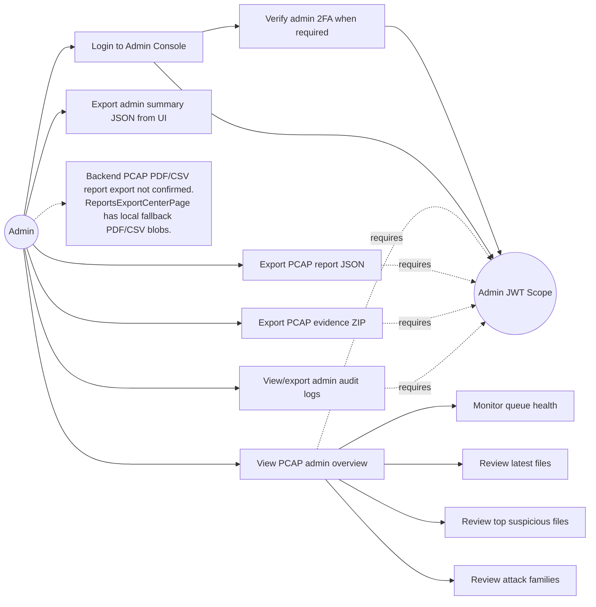

## 4.6 User Interface Design Flow

### PCAP Analyzer User Interface Flow

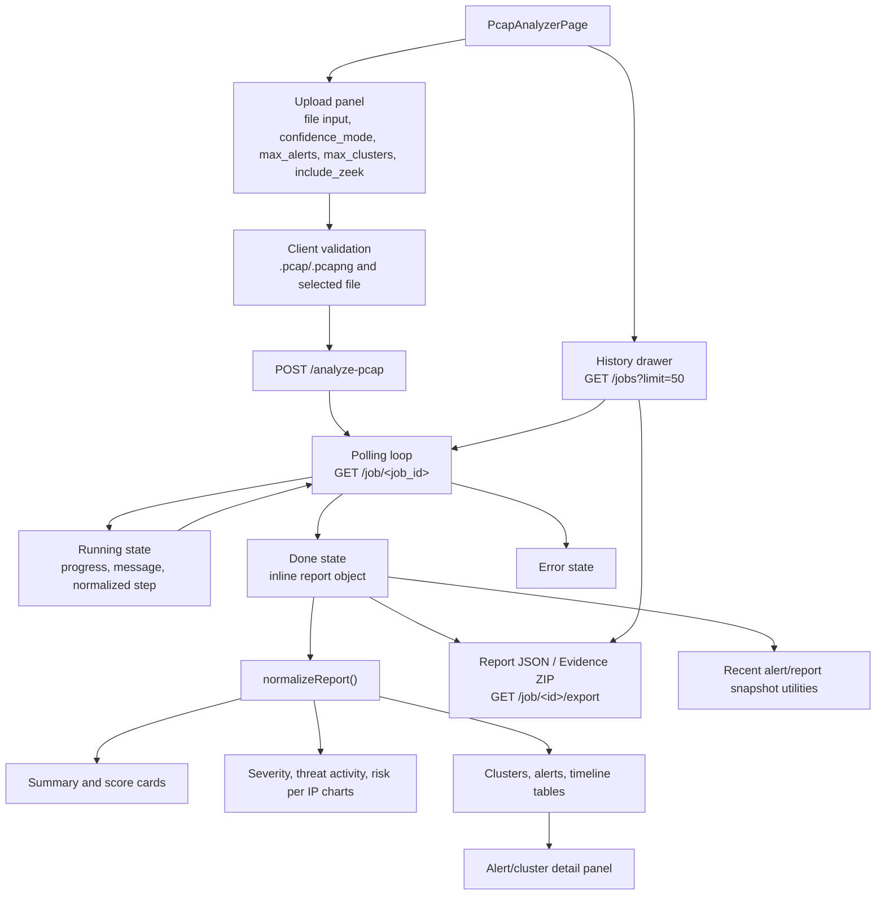

### Admin PCAP Interface Flow

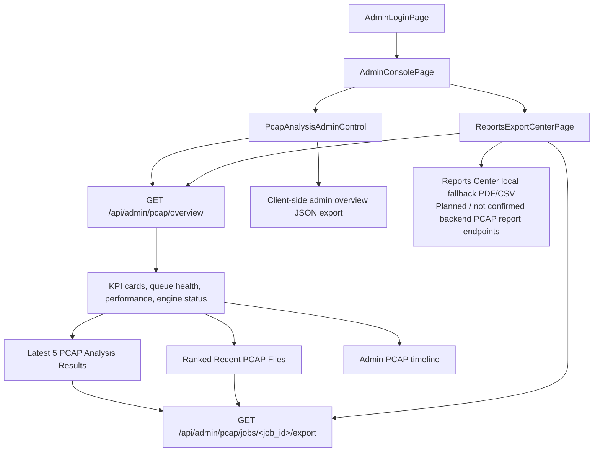

### PCAP Chatbot UI Flow

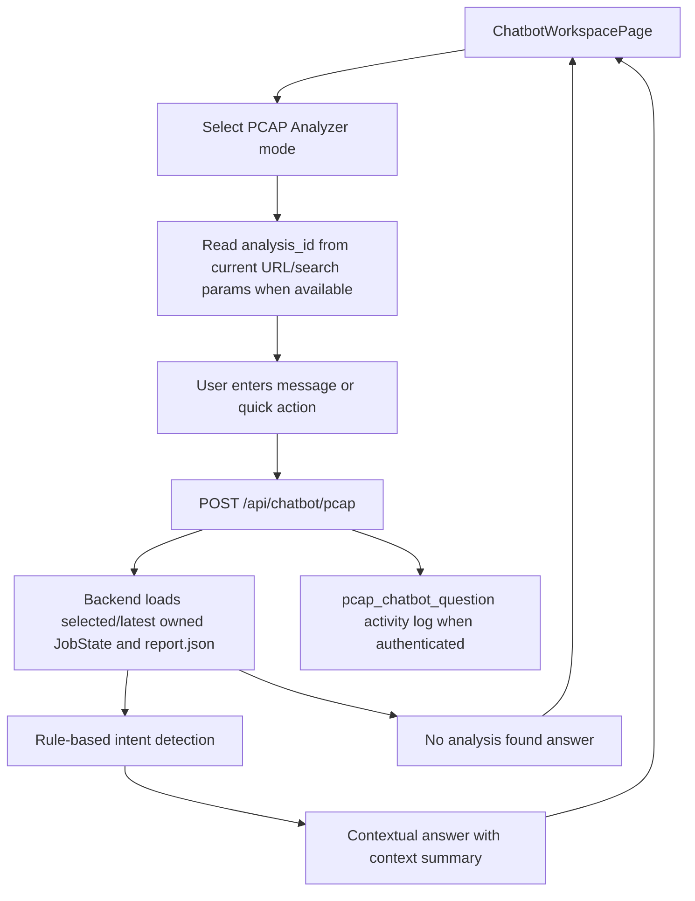

## Manual Verification Checklist

- Confirm Mermaid renders without syntax errors in the Chapter 4 document renderer.
- Verify endpoint names against `Backend/app.py` before final submission.
- Verify job statuses remain `queued`, `running`, `done`, and `error` in `Backend/pcap_engine/jobs.py`.
- Verify `PcapAlertRecord` and `UserActivityLog` fields against current SQLAlchemy models if migrations are added later.
- Verify whether backend PCAP PDF/CSV admin report endpoints are later implemented; currently they are not confirmed from code.
- Verify Zeek evidence export availability by checking completed jobs that have `evidence_dir` with Zeek log files.
- Verify no secrets, environment values, API keys, passwords, or tokens were copied into this documentation.
